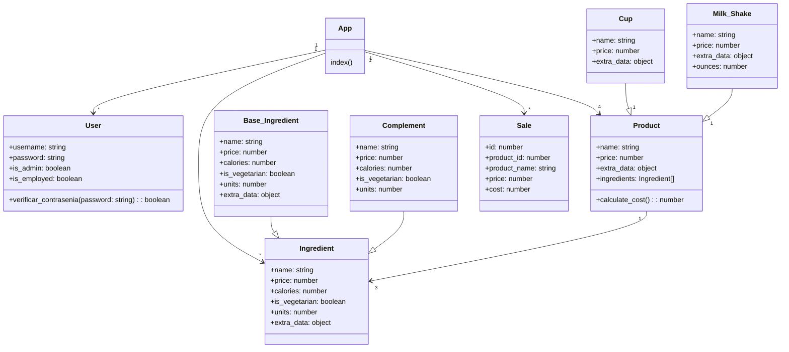

# UML de la aplicación

## Diagrama de clases

```mermaid
classDiagram
  class App {
    index()
  }

  class User {
      +username: string
      +password: string
      +is_admin: boolean
      +is_employed: boolean
      +verificar_contrasenia(password: string): boolean
  }
  class Ingredient {
      +name: string
      +price: number
      +calories: number
      +is_vegetarian: boolean
      +units: number
      +extra_data: object
  }
  class Product {
      +name: string
      +price: number
      +extra_data: object
      +ingredients: Ingredient[]
      +calculate_cost(): number
  }
  class Cup {
      +name: string
      +price: number
      +extra_data: object
  }
  class Milk_Shake {
      +name: string
      +price: number
      +extra_data: object
      +ounces: number
  }
  class Complement {
      +name: string
      +price: number
      +calories: number
      +is_vegetarian: boolean
      +units: number
  }
  class Base_Ingredient {
      +name: string
      +price: number
      +calories: number
      +is_vegetarian: boolean
      +units: number
      +extra_data: object
  }
  class Sale {
      +id: number
      +product_id: number
      +product_name: string
      +price: number
      +cost: number
  }

  App "1" --> "*" Ingredient
  App "1" --> "4" Product
  App "1" --> "*" User
  App "1" --> "*" Sale
  Base_Ingredient --|> Ingredient
  Complement --|> Ingredient
  Cup --|> "1" Product
  Milk_Shake --|> "1" Product
  Product "1" --> "3" Ingredient

```